# 📌 Kriyo – Modern Task Management Platform

Kriyo is a **modern, scalable task management platform** built with a microservices architecture and designed for individual productivity and team collaboration. It features a **TurboRepo monorepo** setup with full-stack TypeScript implementation, offering a clean dashboard interface for task tracking, project management, and calendar integration.


---

## 🏗️ Architecture Overview

### Microservices Architecture

Kriyo follows a distributed microservices pattern with:

- **5 Backend Services** (NestJS + PostgreSQL)
- **1 Frontend Application** (Next.js + TailwindCSS)
- **1 API Gateway** (centralized routing and caching)
- **Shared Middleware Package** (cross-service validation)

### Service Breakdown

| Service            | Port | Technology               | Purpose                             |
| ------------------ | ---- | ------------------------ | ----------------------------------- |
| `kriyo-ui`         | 3000 | Next.js 15.4 + Turbopack | Frontend dashboard and UI           |
| `auth-service`     | 4000 | NestJS + Better Auth     | Authentication & session management |
| `user-service`     | 4200 | NestJS + Prisma          | User profiles and management        |
| `tasks-service`    | 4400 | NestJS + Prisma          | Task CRUD operations                |
| `projects-service` | 4600 | NestJS + Prisma          | Project management                  |
| `kriyo-api`        | 8000 | NestJS API Gateway       | Service orchestration & caching     |

---

## 🚀 Key Features

✅ **Microservices Architecture** with NestJS backend services  
✅ **Modern Frontend** with Next.js 15 + Turbopack + TailwindCSS  
✅ **Authentication** via Better Auth with session management  
✅ **Database** PostgreSQL with Prisma ORM per service  
✅ **API Gateway** with rate limiting, caching, and Swagger docs  
✅ **Real-time Task Management** with priority ranking and filtering  
✅ **Project Organization** with task assignment and tracking  
✅ **Calendar Integration** for due date management  
✅ **Responsive Dashboard** with AG Grid data tables  
✅ **Form Validation** with React Hook Form + Yup schemas  
✅ **Mock API Support** with MSW for development  
✅ **Comprehensive Testing** with Jest + React Testing Library  
✅ **TurboRepo** for optimized builds and caching

---

## 🛠️ Technology Stack

### Frontend (`kriyo-ui`)

- **Framework**: Next.js 15.4.2 with Turbopack
- **UI Library**: TailwindCSS 4.x + Radix UI components
- **State Management**: TanStack Query + React Context
- **Authentication**: Better Auth React client
- **Forms**: React Hook Form + Yup validation
- **Data Tables**: AG Grid React with sorting and filtering
- **Calendar**: react-day-picker integration
- **Testing**: Jest + React Testing Library + MSW
- **Development**: Hot reloading with MSW API mocking

### Backend Services

- **Framework**: NestJS 11.x (all services)
- **Database**: PostgreSQL with Prisma ORM
- **Authentication**: Better Auth with Prisma adapter
- **API Documentation**: Swagger/OpenAPI integration
- **Validation**: Custom middleware package (@kriyo/middlewares)
- **Testing**: Jest unit tests + Supertest E2E tests
- **Development**: Hot reloading with Prisma generation

### Infrastructure

- **Monorepo**: TurboRepo with parallel builds and caching
- **Package Manager**: npm@11.4.2 with workspaces
- **Process Management**: Concurrently.js for multi-service startup
- **Development**: Environment-based configuration

---

## 📦 Project Structure

```
kriyo/
├── apps/                           # Applications
│   ├── auth-service/              # Authentication service (Port 4000)
│   │   ├── src/                   # NestJS source code
│   │   ├── prisma/                # Database schema and migrations
│   │   └── package.json           # Service dependencies
│   ├── user-service/              # User management service (Port 4200)
│   ├── tasks-service/             # Task management service (Port 4400)
│   ├── projects-service/          # Project management service (Port 4600)
│   ├── kriyo-api/                 # API Gateway service (Port 8000)
│   └── kriyo-ui/                  # Frontend application (Port 3000)
│       ├── src/app/               # Next.js App Router
│       │   ├── components/        # Reusable UI components
│       │   ├── hooks/             # Custom React hooks
│       │   ├── pages/             # Feature-based page modules
│       │   ├── providers/         # Context providers
│       │   ├── services/          # API service layer
│       │   └── mocks/             # MSW handlers
│       └── public/                # Static assets
├── packages/                      # Shared packages
│   └── middlewares/               # Shared NestJS middleware
├── docs/                          # Documentation
├── concurrently.js               # Multi-service startup script
├── turbo.json                    # TurboRepo configuration
├── package.json                  # Root dependencies and scripts
└── README.md                     # This file
```

---

## 🗄️ Database Schema

Each service maintains its own PostgreSQL database with the following key models:

### auth-service (Better Auth Schema)

```sql
User        (id, name, email, emailVerified, image, createdAt, updatedAt)
Session     (id, expiresAt, token, userId, ipAddress, userAgent)
Account     (id, accountId, providerId, userId, accessToken, refreshToken)
Verification(id, identifier, value, expiresAt)
```

### user-service

```sql
User (id, email, phone, betterAuthId, name, passwordHash, emailVerified, phoneVerified)
```

### tasks-service

```sql
Task (id, createdBy, title, description, dueDate, status, priority, priorityRank, project, assignedTo)
```

### projects-service

```sql
Project (id, owner, title, description, status, tasks[], targetDate, priority, priorityRank, assignedTo)
```

---

## 📋 Prerequisites

- **Node.js** >= 18.x (LTS) ✅
- **npm** >= 9.x ✅
- **PostgreSQL** >= 14.x ✅
- **Git** for version control ✅
- **(Optional)** Docker for containerization

---

## 📥 Installation & Setup

### 1. Clone and Install Dependencies

```bash
# Clone the repository
git clone https://github.com/your-username/kriyo.git
cd kriyo

# Install all dependencies (root + all services)
npm install
```

### 2. Database Setup

Create PostgreSQL databases for each service:

```bash
# Create databases
createdb kriyo_auth
createdb kriyo_users
createdb kriyo_tasks
createdb kriyo_projects
```

### 3. Database Migrations

Run Prisma migrations for each service:

```bash
# Run migrations for all services
npm run db:migrate:all

# Or manually for each service:
cd apps/auth-service && npx prisma migrate dev
cd apps/user-service && npx prisma migrate dev
cd apps/tasks-service && npx prisma migrate dev
cd apps/projects-service && npx prisma migrate dev
```

### 4. Build Shared Packages

```bash
npm run build:middlewares
```

---

## 🚀 Development Commands

### Start All Services (Recommended)

```bash
# Start all services concurrently with colored output
npm start

# Or using TurboRepo (alternative)
npm run dev
```

This will start:

- `kriyo-ui` at http://localhost:3000
- `auth-service` at http://localhost:4000
- `user-service` at http://localhost:4200
- `tasks-service` at http://localhost:4400
- `projects-service` at http://localhost:4600
- `kriyo-api` at http://localhost:8000

### Individual Service Commands

#### Frontend (kriyo-ui)

```bash
npm run dev --workspace apps/kriyo-ui         # Next.js dev server
npm run test --workspace apps/kriyo-ui        # Jest tests
npm run test:watch --workspace apps/kriyo-ui  # Watch mode tests
npm run test:coverage --workspace apps/kriyo-ui # Coverage report
npm run build --workspace apps/kriyo-ui       # Production build
```

#### Backend Services

For each service (`auth-service`, `user-service`, `tasks-service`, `projects-service`, `kriyo-api`):

```bash
npm run dev --workspace apps/{service-name}    # NestJS dev server
npm run test --workspace apps/{service-name}   # Unit tests
npm run test:e2e --workspace apps/{service-name} # E2E tests
npm run build --workspace apps/{service-name}  # Production build
npm run lint --workspace apps/{service-name}   # Lint code
```

### Root Level Commands

```bash
npm run dev          # TurboRepo: Start all services
npm run build        # TurboRepo: Build all apps
npm run test         # Run tests across all apps
npm run lint         # Lint all apps
npm run clean        # Clean all build artifacts
```

---

## 🏗️ API Architecture Documentation

### API Gateway (Port 8000)

- **Swagger UI**: http://localhost:8000/api/docs
- **Health Check**: http://localhost:8000/api/health

### 🌐 Gateway Flow

```mermaid
sequenceDiagram
    participant UI as 🖥️ Kriyo UI
    participant API as 🌐 Kriyo API
    participant AUTH as 🔐 Auth Service
    participant TASKS as ✅ Tasks Service
    participant PROJ as 📁 Projects Service
    participant USER as 👤 User Service

    UI->>API: API Request + Session Cookie
    API->>AUTH: Validate Session
    alt Authentication Required
        API->>AUTH: Verify Session
        AUTH-->>API: Session Valid
    end
    API->>TASKS: Forward Request
    TASKS-->>API: Service Response
    API->>PROJ: Forward Request
    PROJ-->>API: Service Response
    API->>USER: Forward Request
    USER-->>API: Service Response
    API-->>UI: Formatted Response
```



### 🎯 Route Categories

| Route Pattern      | Access Level         | Description                               |
| ------------------ | -------------------- | ----------------------------------------- |
| **`/my/*`**        | 👤 **User-Owned**    | Resources belonging to authenticated user |
| **`/protected/*`** | 🔐 **Authenticated** | Any authenticated user can access         |
| **`/public/*`**    | 🌍 **Public**        | No authentication required                |

---

## 📡 API Endpoints

### 🏠 Health & System

- **`GET /api/v1/health`** - Service health check
- **`GET /api/v1/version`** - API version information

### 📊 Dashboard

- **`GET /api/v1/my/dashboard/tasks`** - Personal task analytics
- **`GET /api/v1/my/dashboard/projects`** - Project overview

### ✅ Tasks Management

- **`GET /api/v1/my/tasks`** - Get user's tasks
- **`POST /api/v1/my/tasks`** - Create new task
- **`PUT /api/v1/my/tasks/:id`** - Update task
- **`DELETE /api/v1/my/tasks/:id`** - Delete task
- **`GET /api/v1/my/tasks/:dueDate`** - Tasks by due date
- **`GET /api/v1/protected/tasks/search/:search`** - Search tasks

### 📁 Projects Management

- **`GET /api/v1/my/projects`** - Get user's projects
- **`POST /api/v1/my/projects`** - Create new project
- **`PUT /api/v1/my/projects/:id`** - Update project
- **`DELETE /api/v1/my/projects/:id`** - Delete project
- **`GET /api/v1/protected/projects/search/:search`** - Search projects

### 👤 User Profile

- **`GET /api/v1/my/profile`** - Get user profile
- **`PUT /api/v1/my/profile`** - Update profile

> 📖 **Detailed API Documentation:** [View Complete API Routes Guide](./API_ROUTES.md)

### Key API Routes

```
POST   /api/auth/sign-in/email          # User login
POST   /api/auth/sign-up/email          # User registration
GET    /api/v1/my/dashboard/tasks       # Dashboard tasks
GET    /api/v1/my/dashboard/projects    # Dashboard projects
GET    /api/v1/my/tasks                 # List user tasks
POST   /api/v1/my/tasks                 # Create task
PUT    /api/v1/my/tasks/:id             # Update task
DELETE /api/v1/my/tasks/:id             # Delete task
GET    /api/v1/my/projects              # List user projects
POST   /api/v1/my/projects              # Create project
GET    /api/v1/my/profile               # User profile
PUT    /api/v1/my/profile               # Update profile
```

---

## 🧪 Testing

### Frontend Testing

```bash
# Run all tests
npm run test --workspace apps/kriyo-ui

# Watch mode for development
npm run test:watch --workspace apps/kriyo-ui

# Coverage report
npm run test:coverage --workspace apps/kriyo-ui
```

### Backend Testing

```bash
# Unit tests for all services
npm run test

# E2E tests for specific service
npm run test:e2e --workspace apps/tasks-service

# Test specific service
npm run test --workspace apps/auth-service
```

### Test Structure

- **Frontend**: `*.test.tsx` files with Jest + React Testing Library + MSW
- **Backend**: `*.spec.ts` files with Jest + Supertest for E2E
- **Coverage**: Comprehensive coverage reporting available

---

## 🏗️ Production Build

### Build All Services

```bash
# Build everything using TurboRepo
npm run build

# Or build individual services
npm run build --workspace apps/kriyo-ui
npm run build --workspace apps/auth-service
```

### Environment Variables

For production, update environment variables in each service:

- Replace localhost URLs with production domains
- Use production database URLs
- Set `NODE_ENV=production`
- Configure proper CORS origins
- Use secure session secrets

---

## 📊 Key Features Breakdown

### Dashboard

- **Task Overview**: Today's tasks, overdue tasks, upcoming deadlines
- **Project Summary**: Active projects with progress tracking
- **Calendar Integration**: Interactive calendar for date-based navigation
- **Quick Actions**: Add tasks, create projects, filter views

### Task Management

- **Full CRUD**: Create, read, update, delete tasks
- **Priority System**: High/Medium/Low with custom ranking
- **Status Tracking**: Todo, In Progress, In Review, Done, Blocked, Cancelled
- **Due Date Management**: Calendar picker with overdue highlighting
- **Assignment**: Assign tasks to users
- **Search & Filter**: Real-time search and filtering capabilities

### Project Management

- **Project Organization**: Group related tasks into projects
- **Project Templates**: Reusable project structures
- **Progress Tracking**: Visual progress indicators
- **Team Collaboration**: Multi-user project assignment

### Authentication & Security

- **Better Auth Integration**: Modern authentication with session management
- **Protected Routes**: Route-level authentication guards
- **CORS Configuration**: Secure cross-origin request handling
- **Rate Limiting**: API rate limiting and throttling
- **Input Validation**: Comprehensive form and API validation

---

## 🔧 Development Tips

### Debugging

- **Frontend**: React DevTools + Browser DevTools
- **Backend**: NestJS built-in logging + debugging support
- **Database**: Prisma Studio for database inspection
- **API**: Swagger UI for API testing

### Hot Reloading

- All services support hot reloading during development
- Frontend: Next.js Fast Refresh
- Backend: NestJS watch mode with Prisma generation

### Code Quality

- **TypeScript**: Strict mode enabled across all services
- **ESLint**: Configured for consistent code style
- **Prettier**: Automated code formatting
- **Husky**: Git hooks for pre-commit checks (if configured)

---

## 📚 Additional Resources

- [Next.js Documentation](https://nextjs.org/docs)
- [NestJS Documentation](https://docs.nestjs.com)
- [Prisma Documentation](https://www.prisma.io/docs)
- [TurboRepo Documentation](https://turbo.build/repo)
- [Better Auth Documentation](https://www.better-auth.com)
- [TailwindCSS Documentation](https://tailwindcss.com)

---

## 🤝 Contributing

1. Fork the repository
2. Create a feature branch: `git checkout -b feature-name`
3. Make your changes and add tests
4. Run the test suite: `npm run test`
5. Commit your changes: `git commit -am 'Add feature'`
6. Push to the branch: `git push origin feature-name`
7. Submit a pull request

---

## 📝 License

This project is licensed under the MIT License. See the LICENSE file for details.

---

## 🚧 Roadmap

- [ ] Docker containerization for all services
- [ ] Kubernetes deployment configurations
- [ ] Real-time notifications with WebSockets
- [ ] Advanced reporting and analytics
- [ ] Mobile application (React Native)
- [ ] Email notifications and reminders
- [ ] Advanced project templates
- [ ] Time tracking integration
- [ ] File attachments for tasks
- [ ] Advanced user permissions and roles

---

**Built with ❤️ using TypeScript, React, NestJS, and PostgreSQL**
