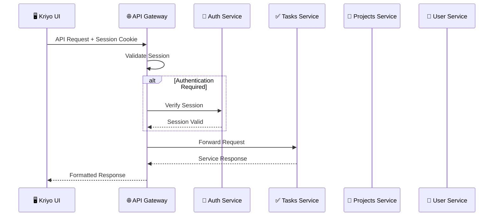

# 🌐 Kriyo API Gateway

<div align="center">


**Centralized API Gateway for Kriyo Task Management Platform**

*Smart Routing • Authentication • Microservices Orchestration*

</div>

---

## 🚀 What is Kriyo API Gateway?

The **Kriyo API Gateway** is the central nervous system of the Kriyo ecosystem. Built with **NestJS** and **TypeScript**, it provides intelligent routing, authentication, and seamless communication between frontend and backend microservices.

### 🎯 Key Responsibilities

🛣️ **Smart Routing** – Route requests to appropriate microservices  
🔐 **Authentication Guard** – Validate Better Auth session cookies  
⚡ **Load Balancing** – Distribute requests efficiently  
🛡️ **Security Layer** – CORS, rate limiting, and request validation  
📊 **Request Logging** – Centralized logging and monitoring  
🔄 **Error Handling** – Graceful error responses and fallbacks  

---

## 🏗️ Architecture

### 🌐 Gateway Flow



### 🎯 Route Categories

| Route Pattern | Access Level | Description |
|---------------|--------------|-------------|
| **`/my/*`** | 👤 **User-Owned** | Resources belonging to authenticated user |
| **`/protected/*`** | 🔐 **Authenticated** | Any authenticated user can access |
| **`/public/*`** | 🌍 **Public** | No authentication required |

---

## 📡 API Endpoints

### 🏠 Health & System
- **`GET /api/v1/health`** - Service health check
- **`GET /api/v1/version`** - API version information

### 📊 Dashboard
- **`GET /api/v1/my/dashboard/tasks`** - Personal task analytics
- **`GET /api/v1/my/dashboard/projects`** - Project overview

### ✅ Tasks Management
- **`GET /api/v1/my/tasks`** - Get user's tasks
- **`POST /api/v1/my/tasks`** - Create new task
- **`PUT /api/v1/my/tasks/:id`** - Update task
- **`DELETE /api/v1/my/tasks/:id`** - Delete task
- **`GET /api/v1/my/tasks/:dueDate`** - Tasks by due date
- **`GET /api/v1/protected/tasks/search/:search`** - Search tasks

### 📁 Projects Management
- **`GET /api/v1/my/projects`** - Get user's projects
- **`POST /api/v1/my/projects`** - Create new project
- **`PUT /api/v1/my/projects/:id`** - Update project
- **`DELETE /api/v1/my/projects/:id`** - Delete project
- **`GET /api/v1/protected/projects/search/:search`** - Search projects

### 👤 User Profile
- **`GET /api/v1/my/profile`** - Get user profile
- **`PUT /api/v1/my/profile`** - Update profile

> 📖 **Detailed API Documentation:** [View Complete API Routes Guide](./API_ROUTES.md)

---

## ⚙️ Tech Stack

| Component | Technology | Purpose |
|-----------|------------|---------|
| **Framework** | NestJS 11 | Scalable Node.js framework |
| **Language** | TypeScript | Type-safe development |
| **HTTP Client** | Axios | Service-to-service communication |
| **Authentication** | Better Auth Cookies | Session validation |
| **Validation** | Class Validator | Request/response validation |
| **Testing** | Jest + Supertest | Unit and integration tests |
| **Documentation** | Swagger (planned) | API documentation |

---

## 🚀 Quick Start

### 📋 Prerequisites
```bash
Node.js >= 18.x
npm >= 9.x
PostgreSQL >= 14.x (for connected services)
```

### ⚡ Installation
```bash
# Navigate to the API Gateway
cd apps/kriyo-api

# Install dependencies
npm install

# Start in development mode
npm run dev

# Or start with file watching
npm run start:dev
```

### 🌍 Access Points
- **Gateway URL:** [http://localhost:4004](http://localhost:4004)
- **Health Check:** [http://localhost:4004/api/v1/health](http://localhost:4004/api/v1/health)
- **API Base:** `http://localhost:4004/api/v1`

---

## 🔧 Development

### 📜 Available Scripts

```bash
# 🔥 Development
npm run dev              # Start with file watching
npm run start:dev        # NestJS development mode
npm run start:debug      # Debug mode with inspector

# 📦 Production
npm run build            # Compile TypeScript
npm run start:prod       # Production mode

# 🧪 Testing
npm run test             # Unit tests
npm run test:watch       # Tests in watch mode
npm run test:e2e         # End-to-end tests
npm run test:cov         # Test coverage

# ✨ Code Quality
npm run lint             # ESLint checking
npm run format           # Prettier formatting
```

### 🔑 Environment Variables

Create a `.env` file in the app root:

```env
# Server Configuration
PUBLIC_API_PORT=4004
NODE_ENV=development

# Service URLs
AUTH_SERVICE_URL=http://localhost:4001
USER_SERVICE_URL=http://localhost:4002
TASKS_SERVICE_URL=http://localhost:4003
PROJECTS_SERVICE_URL=http://localhost:4005

# Frontend Configuration
KRIYO_UI_BASE_URL=http://localhost:3000

# Security
CORS_ORIGINS=http://localhost:3000,http://localhost:3001
RATE_LIMIT_MAX=100
RATE_LIMIT_WINDOW=900000

# Logging
LOG_LEVEL=debug
ENABLE_REQUEST_LOGGING=true
```

---

## 🏛️ Project Structure

```
src/
├── 🔐 auth/                    # Authentication system
│   ├── auth.guard.ts          # Session validation guard
│   └── user.decorator.ts      # Current user decorator
├── 📂 modules/                # Feature modules
│   ├── dashboard/             # Dashboard endpoints
│   ├── tasks/                 # Tasks management
│   ├── projects/              # Projects management
│   └── profile/               # User profile
├── 🌐 services/               # Shared services
│   ├── http-client.service.ts # HTTP client for microservices
│   └── services.module.ts     # Services module
├── 📋 dto/                    # Data Transfer Objects
├── 🛡️ guards/                 # Request guards
├── 🔧 interceptors/           # Request/response interceptors
├── app.controller.ts          # Health check controller
├── app.module.ts              # Main application module
└── main.ts                    # Application bootstrap
```

---

## 🛡️ Security Features

### 🔐 Authentication
- **Session-based auth** via Better Auth cookies
- **HTTP-only cookies** for security
- **Automatic session validation** on protected routes
- **User context injection** in controllers

### 🛠️ Request Protection
- **CORS configuration** for cross-origin requests
- **Rate limiting** to prevent abuse
- **Request validation** using DTOs
- **Error sanitization** for production

### 🔍 Monitoring
- **Request logging** with correlation IDs
- **Performance metrics** collection
- **Health checks** for service monitoring
- **Error tracking** integration ready

---

## 🧪 Testing

### 🎯 Test Categories

| Type | Framework | Files | Purpose |
|------|-----------|-------|---------|
| **Unit** | Jest | `*.spec.ts` | Component testing |
| **Integration** | Jest + Supertest | `*.e2e-spec.ts` | API endpoint testing |
| **Service** | Jest | Service mocking | Business logic testing |

### 📊 Running Tests
```bash
# Run all tests
npm run test

# Watch mode for development
npm run test:watch

# Generate coverage report
npm run test:cov

# End-to-end API tests
npm run test:e2e
```

### 🎭 Mocking Strategy
- **HTTP clients** mocked for unit tests
- **Database operations** mocked in service tests
- **Authentication** bypassed in test environment
- **External APIs** stubbed with test data

---

## 🚀 Deployment

### 🐳 Docker Support (Planned)
```dockerfile
# Production-ready Dockerfile
FROM node:18-alpine
WORKDIR /app
COPY package*.json ./
RUN npm ci --only=production
COPY dist/ ./dist/
CMD ["node", "dist/main.js"]
```

### ☁️ Environment Setup
```bash
# Production environment variables
NODE_ENV=production
PUBLIC_API_PORT=4004
LOG_LEVEL=warn
ENABLE_REQUEST_LOGGING=false
```

---

## 🔮 Roadmap

### 🔜 Next Features
- [ ] 📊 **Swagger Documentation** - Auto-generated API docs
- [ ] 🔄 **Rate Limiting** - Advanced request throttling
- [ ] 📈 **Monitoring** - Prometheus metrics integration
- [ ] 🔍 **Distributed Tracing** - OpenTelemetry support
- [ ] 🛡️ **API Versioning** - Support for v2 endpoints

### 🏗️ Infrastructure
- [ ] 🐳 **Docker Configuration** - Container deployment
- [ ] 🚀 **CI/CD Pipeline** - Automated deployment
- [ ] ☁️ **Cloud Deployment** - AWS/GCP integration
- [ ] 📊 **Load Balancing** - Multi-instance support

---

## 🤝 Contributing

### 🔧 Development Workflow
1. **Fork & Clone** the repository
2. **Create feature branch:** `git checkout -b feature/api-enhancement`
3. **Install dependencies:** `npm install`
4. **Start development:** `npm run dev`
5. **Run tests:** `npm run test`
6. **Submit PR** with clear description

### 📏 Code Standards
- ✅ **TypeScript strict mode** enabled
- 🧪 **Test coverage** > 80% for new features
- 📝 **NestJS decorators** for clean architecture
- 🔐 **Security-first** approach for all endpoints

---

## 📚 Resources

- 📖 **[Complete API Routes Documentation](./API_ROUTES.md)**
- 🌐 **[NestJS Documentation](https://docs.nestjs.com)**
- 🔐 **[Better Auth Guide](https://better-auth.com)**
- ⚡ **[Axios Documentation](https://axios-http.com)**

---

<div align="center">

**🌐 Kriyo API Gateway - Powering the Kriyo Ecosystem**

*Built with ❤️ using NestJS and TypeScript*

</div>